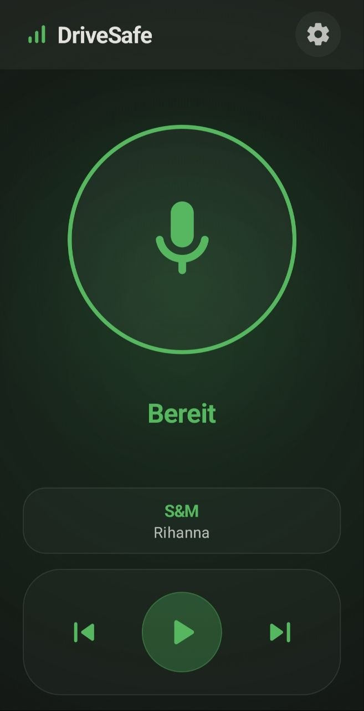
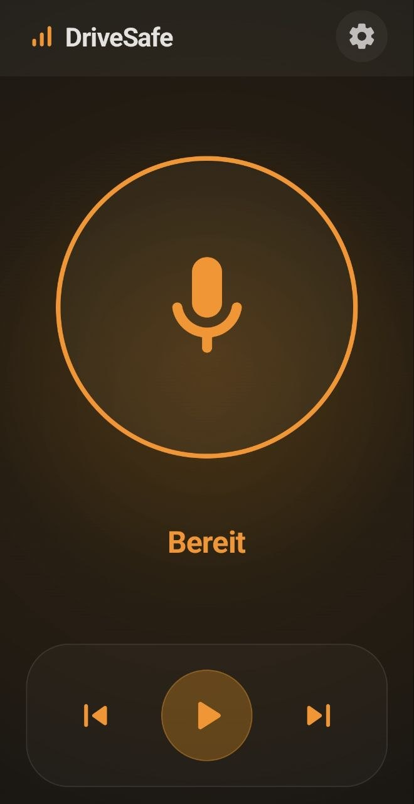
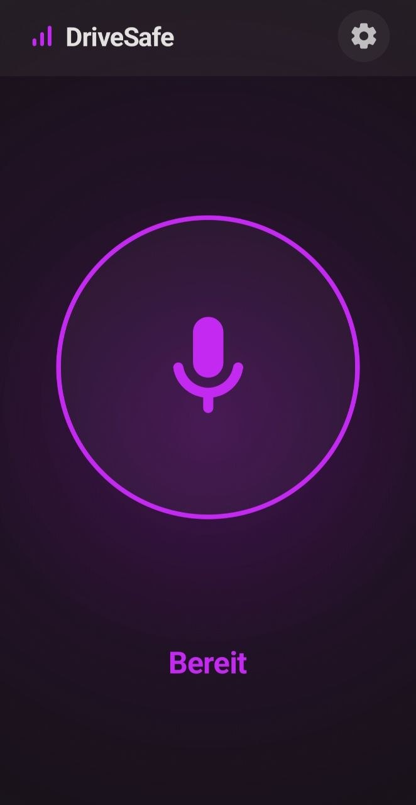
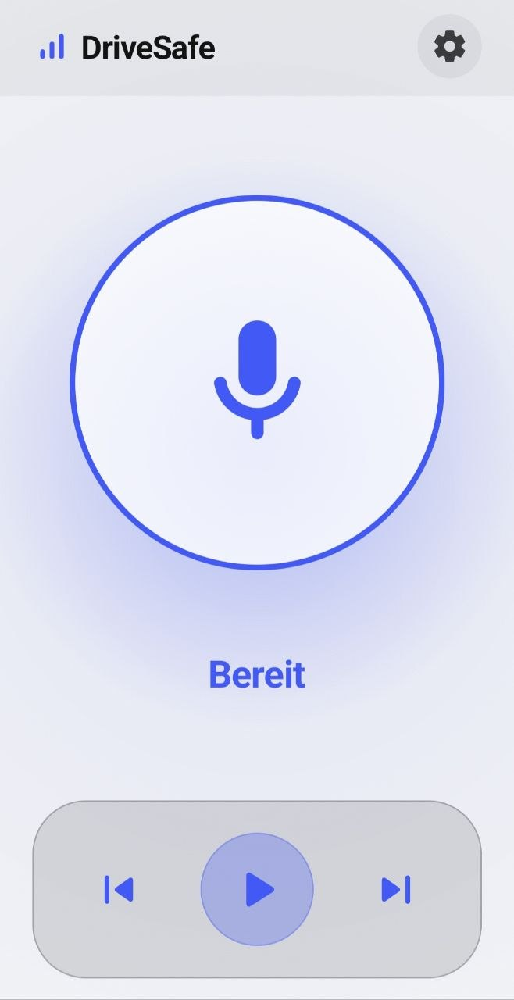
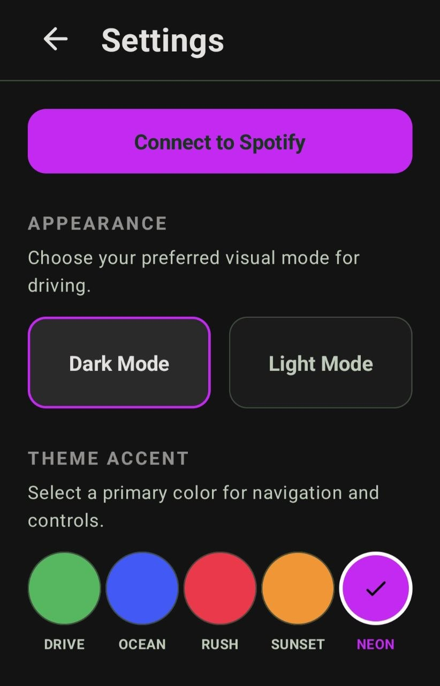
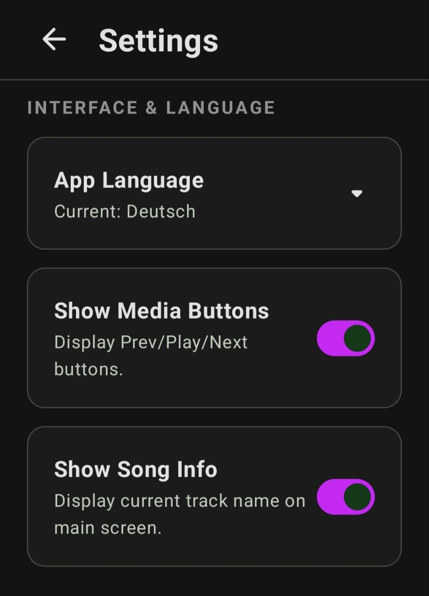
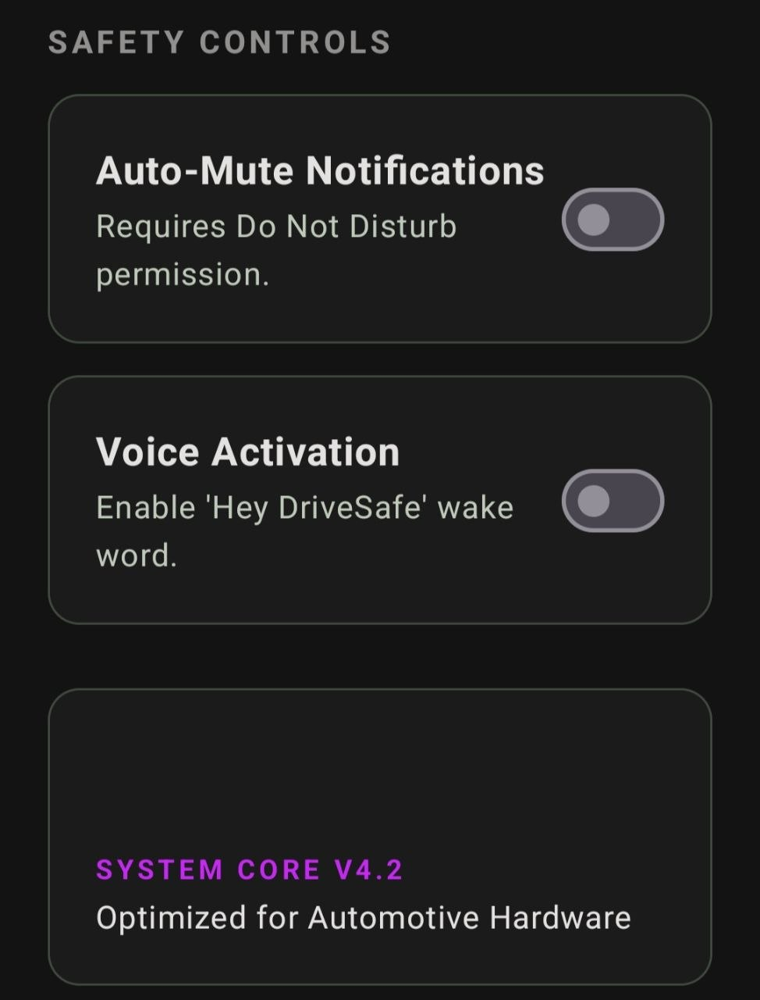

# Spotify Voice Control

An Android application that enables voice-controlled interactions with Spotify playback. Developed using Kotlin and Jetpack Compose.

> [!NOTE]
> **Language Support**: The voice command parser is currently exclusively optimized for the **German language** (e.g., "Spiele...", "Lauter", "Warteschlange"). However, the underlying architecture can be easily extended to support other languages.

## Screenshots

  
  
  

  
  
  

  

## Features

- **Basic Playback Control**: Play, pause, skip to the next or previous track, and restart the current track.
- **Search & Play**: Search for specific songs, artists, or albums and play them instantly.
- **Queue Management**: Add specific songs to your Spotify queue via voice command.
- **Playlist Management**: Save the currently playing song to one of your personal playlists.
- **Seek Control**: Fast-forward or rewind by a specific amount of time (e.g., "seek forward 30 seconds").
- **Volume Control**: Adjust the device volume (up, down, or significantly louder/quieter) without touching the screen.
- **Playback Modes**: Toggle shuffle and repeat modes on or off.
- **Status Inquiry**: Ask what song or artist is currently playing.
- **Audio Feedback**: Provides audio confirmations upon successful command recognition or action execution.
- **Modern User Interface**: Built using Jetpack Compose for a responsive and declarative UI architecture.
- **Authentication**: Implements the OAuth 2.0 PKCE (Proof Key for Code Exchange) flow for secure Spotify Web API access.

## Requirements

- **Spotify Premium**: A Spotify Premium account is strictly required. The underlying Spotify App Remote SDK and many Web API endpoints restrict remote playback manipulation to Premium users.
- **Spotify App**: The official Spotify application must be installed on the Android device for the App Remote connection to work.

## Tech Stack

- **Language**: Kotlin
- **UI Framework**: Jetpack Compose
- **Asynchronous Operations**: Kotlin Coroutines & StateFlow
- **API Communication**: Retrofit
- **Authentication**: Spotify OAuth PKCE Flow
- **Voice Recognition**: Android SpeechRecognizer

## Setup Instructions

1. Clone this repository to your local development environment.
2. Open the project in Android Studio.
3. Register a new application on the [Spotify Developer Dashboard](https://developer.spotify.com/dashboard/):
   - Obtain a `Client ID`.
   - Add the Redirect URI: `spotifyvoicecontrol://callback` in the application settings.
4. Open `MainActivity.kt` and replace the `clientId` variable with your obtained Client ID.
5. Build and deploy the application to a physical Android device.

## Security

This repository utilizes the PKCE authentication flow. The `Client ID` present in the source code is a public identifier and does not constitute a security risk for mobile applications. No `Client Secret` is required or stored within this codebase.
